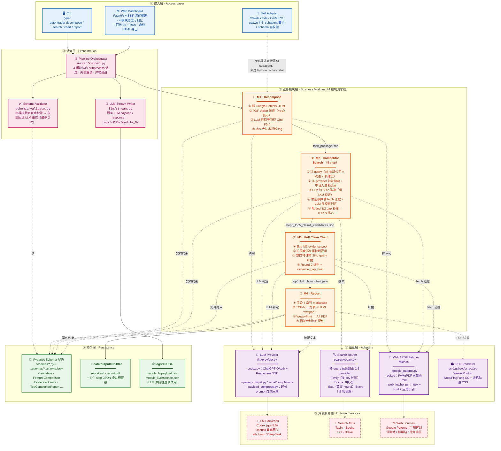
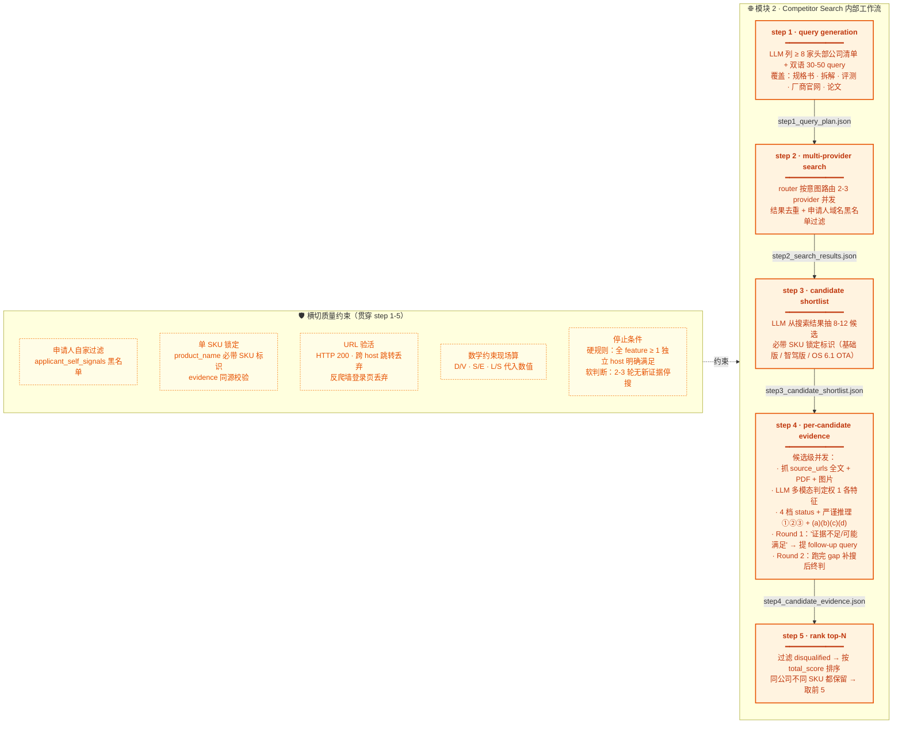
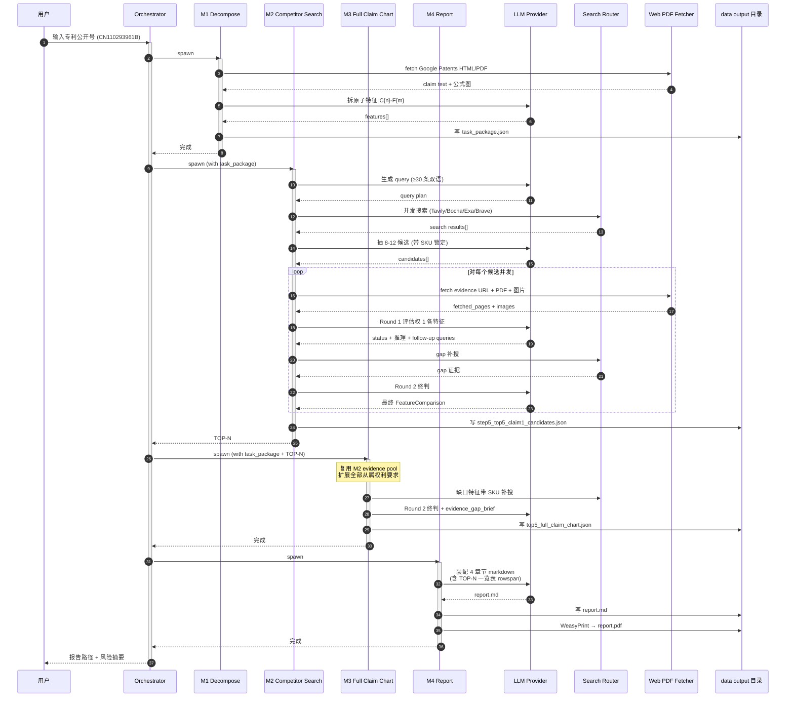

<div align="center">

# PatentRadar

**专利侵权竞品分析**

输入一个专利公开号，输出一份竞品侵权分析报告——内容包括：逐项技术特征对比表、可点击的公开证据 URL、以及“还缺什么证据 / 下一步去哪查”的可执行建议。


[](https://github.com/astral-sh/uv)
[](#-llm-后端)
[](#模式-b作为-skill-嵌入-claude-code--codex-cli)
[](#-license)

https://github.com/user-attachments/assets/94f8f758-6a43-49a8-b16b-2e04e1d8e110

[快速开始](#-快速开始) · [Skill 模式](#模式-b作为-skill-嵌入-claude-code--codex-cli) · [Examples](examples/README.md) · [评估](evaluate/EVALUATION.md)

</div>

---

## 为什么需要 PatentRadar

> 传统侵权排查靠人工：律师团队读专利权 → 拆特征 → 翻竞品手册 → 搜证据 → 写 claim chart，一份高质量报告动辄 3-5 天。

PatentRadar 把这条链路压到 **1 小时**：4 个模块串行流水线 + 多源搜索 + 多模态证据抓取 + 严苛评分规则，让 LLM 做"信息整理"和"逐特征对比"，把 **可追溯复核** 的 侵权分析报告直接交到律师手上。

## 🚀 快速开始

### 部署：两种模式

| 维度 | 模式A：独立部署 | 模式B：skill 嵌入（最简单，推荐） |
|---|---|---|
| **所需依赖** | **1、至少一个搜索工具（Tavily / Bocha / Exa / Brave 任一即可）2、大模型的api** | **零额外依赖，只需要codex或其他agent** |
| 调度 | [`server/runner.py`](src/patentradar/server/runner.py) 串 4 个 CLI subprocess | 主 agent spawn 4 个 subagent |
| LLM 调用 | 项目内的 [`llm/provider.py`](src/patentradar/llm/provider.py) 统一发包 | 由宿主 agent（Claude Code / Codex）的对话能力直接调用 |
| 搜索 / 抓页 | 项目内的 [`search/`](src/patentradar/search/) + [`fetcher/`](src/patentradar/fetcher/) 模块 | 由宿主 agent 的 WebSearch / WebFetch 工具直接调用 |
| 可观测追溯 | Web Dashboard + 4 个 module log 文件 | 宿主 agent 的对话窗口 + 落盘 JSON |

#### 注：关于模式A的所需依赖说明
- **搜索工具**：推荐四个搜索工具全部连接，模式A综合使用四个搜索工具，将不同工具的搜索性能极致发挥，其中tavily是主力搜索工具，消耗额度较高，所以.env中可配置多个tavily的api-key轮换使用。（如需大量低价api-key，可前往闲鱼购买）
    - [Tavily](https://www.tavily.com/)
    - [博查 API](https://open.bochaai.com/)
    - [Exa](https://exa.ai/)
    - [Brave Search API](https://brave.com/search/api/)
- **大模型**：模式A需要自己配置大模型的api-key，支持两种大模型的配置方式（推荐**chatgpt auth**，便宜、模型强、额度多，且原生支持**structured_outputs**）：
  - **chatgpt auth**（ChatGPT plus以上订阅可用，需本机安装codex cli后在终端运行 `codex login` 完成 OAuth）
  - **其他OpenAI 兼容格式**（aihubmix / DeepSeek / 自建网关）——请参考 [`.env.example`](.env.example)


---
### 模式A：分两种部署方式

#### 方式 （1） · 本地 uv（推荐）

```bash
git clone https://github.com/yuc16/PatentRadar.git
cd PatentRadar
uv sync                              # 装全部依赖
cp .env.example .env                 # 在.env中填入你的所有API keys
```

> **PDF 渲染的系统层依赖** —— `uv sync` 只装 Python 包；WeasyPrint 另需系统级图形库（Pango / Cairo 等），Linux 还需中文字体（macOS / Windows 系统自带中文字体，无需另装）。缺图形库 → 只产出 md、无 PDF；缺中文字体 → PDF 中文乱码。按平台装一次即可（可以让AI帮你装）

**Linux**（Debian / Ubuntu）
```bash
apt install -y libpango-1.0-0 libpangoft2-1.0-0 libcairo2 \
               libgdk-pixbuf-2.0-0 libffi8 shared-mime-info fonts-noto-cjk
```
> 其它发行版换包名，如 Fedora：`pango cairo gdk-pixbuf2` + `google-noto-sans-cjk-fonts`。

**macOS**（Homebrew）
```bash
brew install pango          # 连带 cairo / gdk-pixbuf 等依赖；中文走系统自带 PingFang SC
```

**Windows**
1. 安装 [MSYS2](https://www.msys2.org/)（默认选项）
2. 在 MSYS2 shell 内执行：`pacman -S mingw-w64-x86_64-pango`
3. 中文走系统自带「微软雅黑」，无需另装字体
> 若 `uv run` 报找不到 libgobject / pango 等 DLL，把 `C:\msys64\mingw64\bin` 加入系统 PATH

> 若选 Codex 后端：到宿主机跑 `codex login` 完成 OAuth；选 OpenAI 兼容后端：直接填 `.env`

---
#### 方式 （2） · Docker（无法使用 chatgpt auth）

宿主机只要装 Docker，不需要 Python / uv / weasyprint 系统库。

```bash
git clone https://github.com/yuc16/PatentRadar.git
cd PatentRadar
cp .env.example .env                 # 填入 API keys（容器里必须用 openai 兼容后端）
docker compose up -d --build         # 首次构建并后台启动
open http://localhost:8000           # 浏览器打开 dashboard 即可使用
```

常用维护命令：

```bash
docker compose logs -f                                  # 跟随日志
docker compose down                                     # 关停
docker compose down && docker compose up -d            # 改了 .env 后重启
docker compose down && docker compose up -d --build    # 改了 src/Dockerfile/pyproject 后重建
```

容器内 `/app/data`、`/app/logs`、`/app/configs`、`/app/patentradar_output` 通过 volume 挂到宿主机同名目录，产物落盘后宿主机能直接看到。
### 使用：跑一篇专利

> 命令前缀按你的部署方式替换，命令体和产物路径完全一致：
> - **Docker**：`docker compose exec patentradar <命令>`
> - **本地 uv**：`uv run <命令>`

#### Web Dashboard（**推荐**，可视化 + 完整日志）

Docker 方式启动后即可访问；本地 uv 需要手动起 server，终端运行以下一行命令即可：

```bash
uv run uvicorn patentradar.server.app:app --reload --port 8000
```

浏览器打开 `http://localhost:8000`：

- 输入专利公开号，点「开始分析」即可端到端跑完 4 模块
- 4 个模块进度、每一次 LLM 调用 / 搜索调用 / 网页 fetch 实时显示
- 跑完后可回放（1x / 20x / 100x / 600x 倍速），支持导出离线 HTML 分享给同事
- 完整结构化日志写入 `logs/<PUB>/`：`run.jsonl` + `module_N.log` + `module_N.stream.jsonl`

#### HTTP API（脚本化 / CI 集成）

与 Web Dashboard 同源同接口，适合无人值守：

```bash
curl -X POST http://localhost:8000/api/run/CN110293961B
curl -N    http://localhost:8000/api/stream/CN110293961B   # SSE 实时事件
curl       http://localhost:8000/api/status/CN110293961B   # JSON 快照
```

`POST /api/run/{pub}` 同步校验格式（不合法专利号 → **400** + 错误信息）；
若该 pub 已经在跑则直接 **409**，避免重复启动 BackgroundTask。

#### 分步 CLI（调试 / 重跑某一步）

直接调每个模块的 CLI，业务产物正常落到 `data/output/<PUB>/`，但**没有 `logs/<PUB>/` 结构化日志**（那是 server 模式专属）：

```bash
uv run patentradar decompose CN110293961B
uv run patentradar competitor-search data/output/CN110293961B/task_package.json
uv run patentradar full-claim-chart  data/output/CN110293961B/task_package.json \
                                     data/output/CN110293961B/step5_top5_claim1_candidates.json
uv run patentradar report            data/output/CN110293961B/task_package.json \
                                     data/output/CN110293961B/top5_full_claim_chart.json
```

产物落盘位置（**三种使用方式一致**）：

```
data/output/CN110293961B/
├── task_package.json                # 模块 1：权利要求拆解
├── step1_query_plan.json            # 模块 2 step1：查询计划
├── step2_search_results.json        # 模块 2 step2：搜索原始结果
├── step3_candidate_shortlist.json   #          step3：候选清单
├── step4_candidate_evidence.json    #          step4：逐候选权 1 证据
├── step4_fetched_pages/<cid>.json   #          step4：全文证据池（供模块 3 复用）
├── step4_visual_log_fetched/        #          step4：fetch 阶段抓回的全部图（审计用）
├── step4_visual_log_sent/           #          step4：实际送给 LLM 的图（审计用）
├── step5_top5_claim1_candidates.json#          step5：TOP-N 排名
├── top5_full_claim_chart.json       # 模块 3：全 claim 对比
├── report.md                        # 模块 4：最终报告（markdown）
└── report.pdf                       #         最终报告（PDF）
```

> [`scripts/run_full_pipeline.py`](scripts/run_full_pipeline.py) 是模块 2-4 的**测试 wrapper**（固定从 `tests/decompose/outputs/<PUB>/` 读模块一 fixture），仅供开发期调试，不适合跑生产专利。

---

### 模式 B：作为 skill 嵌入 Claude Code / Codex CLI

把 [`skills/patentradar/`](skills/patentradar/) 目录放到你的 agent 的 skill 路径下（或软链）。

或者直接在你的 agent 中（推荐 codex 或claude code）输入：
```text
> 帮我安装https://github.com/yuc16/PatentRadar这个skill
```
即可完成部署，随后只需要自然语言输入你想要分析的专利公开号

```text
> 帮我跑下 CN114512759B 的侵权竞品分析
```

skill 会自动触发，按顺序 spawn 4 个独立 subagent，每个 subagent 跑完用 JSON Schema 自动校验产物（失败时把错误清单透传给该 subagent 让它修正后重交，最多重试 2 次），4 个模块全跑完后告诉你 `report.md` / `report.pdf` 落盘位置。


---

## 🏗️ 架构

系统采用**分层解耦**设计，从顶到底共 6 层：接入层 → 调度层 → 业务模块层 → 适配层 → 外部服务层 → 持久层。下面给出三个视图：**系统分层架构**、**模块内部工作流**、**核心数据流时序**。

### 视图 1：系统分层架构（6 层）



> **关键设计点**：
> - **接入层与业务层完全解耦**——CLI / Web / Skill 三种入口共享同一套 4 模块业务逻辑，无重复代码
> - **调度层独立**——Orchestrator + Validator + Stream Writer 三件套，让"业务执行"与"流程治理"分离
> - **适配层屏蔽外部不确定性**——LLM 后端切换、搜索 provider 增减、PDF 渲染替换都不会冒泡到业务模块
> - **契约驱动**——Pydantic Schema 同时是「LLM 输出格式约束」、「模块间数据传递契约」、「Validator 自动校验依据」

### 视图 2：4 模块内部工作流（最复杂模块 M2 详细展开）



> M1 / M3 / M4 内部步骤参考 [🔄 4 模块工作流](#-4-模块工作流) 章节。M2 之所以最复杂，是因为它承担「全网竞品发现 + 多模态证据抓取 + Round-1/2 自适应补搜」三件事——其它三个模块均围绕它产出/复用数据。

### 视图 3：核心数据流时序（Sequence）



> 时序图体现两个关键设计：
> 1. **每模块 IO 边界清晰**——模块内部任何步骤失败都不影响其它模块的产物；可基于已落盘 JSON 单步重跑
> 2. **M2 的 Round-1/2 自适应循环**——LLM 不是"一次性给答案"，而是先评估证据缺口、自己提补搜 query、代码端跑完再让 LLM 终判，把搜索深度和评分严格度两个看似矛盾的目标统一起来

### 双模运行结构

```
PatentRadar/
├── src/patentradar/           ← 模式 1：独立项目（直接 uv run）
│   ├── cli.py                 ← typer CLI 入口
│   ├── server/                ← FastAPI Dashboard + SSE
│   ├── modules/               ← 4 模块各自的 pipeline.py
│   ├── llm/                   ← Codex / OpenAI 适配 + prompts/
│   ├── fetcher/               ← Google Patents / PDF / 通用 web fetcher
│   ├── search/                ← 4 个 search provider + 智能路由
│   └── schemas/               ← Pydantic 数据契约（贯穿 4 模块）
│
└── skills/patentradar/           ← 模式 2：作为 Claude Code skill 被其他 agent 调用
    ├── SKILL.md                  ← skill 入口（声明触发词 / 工作流）
    ├── agents/                   ← 4 个 subagent 的完整 prompt
    │   ├── decompose.md
    │   ├── competitor_search.md
    │   ├── full_claim_chart.md
    │   └── report.md
    ├── schemas/                  ← 与 src 完全一致的 JSON Schema 契约
    │   └── validate.py           ← 模块间自动 schema 校验
    ├── configs/                  ← 9 大技术领域 + 垂类网站清单
    │   └── technology_tags.toml
    └── scripts/render_pdf.py     ← 与 src 共用的 PDF 渲染脚本
```

> 两套模式**共享同一份数据契约**（Pydantic schema ↔ JSON Schema）和**同一套核心规则**（评分阈值 / SKU 锁定 / 证据缺口模板），保证报告产出一致。

---

## 🔄 4 模块工作流

### 📑 模块 1 · Decompose（拆解权利要求）

**做什么**：抓 Google Patents 公开文本 → LLM 把每条权利要求（独立 + 从属）拆成原子特征 → 主题前序作为首条 feature 保留 → HTML 有图 / 公式乱码时回退到 PDF Vision 还原。

**产物**：`task_package.json` —— 全部权利要求 + 拆解后的 `C{claim}-F{idx}` 原子特征 + 申请人识别信号 + 技术领域 tag（9 选一）。

### 🌐 模块 2 · Competitor Search（竞品挖掘 + 权 1 判定）

**做什么**：

1. **生成搜索 query**：基于权 1 关键词 + 技术 tag → 30-50 条中英双语 query，按意图（规格书 / 新闻 / 拆解 / 学术）路由到不同 search provider
2. **筛候选**：搜索结果交叉聚合 → LLM 抽出 8-12 个具体竞品（带 SKU 锁定标识）→ 排除申请人自家产品
3. **抓证据**：每个候选独立抓页面 + PDF + 图片 → LLM 多模态评估权 1 各特征 → 给出 `明确满足 / 可能满足 / 证据不足 / 明确不满足` 四档判定
4. **Gap 轮补搜**：对"证据不足 / 可能满足"特征 LLM 主动建议 follow-up query → 代码端跑补搜 → 再判一次
5. **TOP-N 排名**：按 total_score 排序，落 TOP 5 候选

**产物**：`step5_top5_claim1_candidates.json` —— TOP 候选 + 每个候选的权 1 逐特征对比 + 证据 URL / snippet / 图片 + 推理链。

### 📋 模块 3 · Full Claim Chart（全权利要求扩展）

**做什么**：复用模块 2 证据池 + 扩展到**全部从属权利要求** → 缺口特征主动补搜（query 必带 SKU 标识词，避免拉回其他 SKU 资料）→ Round 2 终判 → 对权 1 中所有"证据不足 / 可能满足"特征生成 `evidence_gap_brief`（"还缺什么 / 下一步去哪查"两行）。

**关键设计**：
- **`total_score` 只看权 1**（从属权满足度不进 ranking，避免权 1 已"明确满足"的候选因从属权证据稀疏被错误压低分）
- **失效只看权 1**（仅权 1 任一特征"明确不满足"或 launch_date 早于专利申请日才 disqualified）

**产物**：`top5_full_claim_chart.json`。

### 📝 模块 4 · Report（markdown + PDF 报告）

**做什么**：把模块 1 / 3 数据组装成 4 章节的 markdown 报告 → WeasyPrint 渲染 PDF（A4 + 跨平台中文字体 Noto Sans CJK / PingFang SC / 微软雅黑 + 表格防溢出 CSS）。

**报告结构**：

1. **专利详细信息**　公开号 / 标题 / 申请人 / 发明人 / 申请日 / Google Patents 链接
2. **整体侵权风险评估**　最高分竞品介绍 + 权 1 满足情况速览 + TOP-N 一览表（rowspan 合并单元格的缺口 + 下一步建议汇总）
3. **TOP-N 竞品深度对比**　每个候选展示 SKU 锁定 / 上市日期 / 总分 / 全部权利要求的逐特征对比表（含证据 URL + 完整 reasoning）
4. **相似专利人工核查**（score ≥ 80 才出）　预生成 Google Patents 高级检索深链，让律师核查同族延续案 / 分案

---

## ⚖️ 逐特征对比的侵权评分

模块 2、3 对每个技术特征给的 `明确满足 / 可能满足 / 证据不足 / 明确不满足`，**不是按法律的字面/等同侵权分的，而是一条「证据直接性」刻度**（`claim_score = 各特征分数均值 × 100`）：

| 状态 | 分数 | 含义 |
|---|---|---|
| 明确满足 | 1.0 | 有公开 URL 的**直接字面/数值证据**，能从证据里直接读出 |
| 可能满足 | 0.8 | 没有直接证据，但**由公开证据严谨推理**得出（必须给推理链） |
| 证据不足 | 0.3 | 证据池里找不到相关线索 |
| 明确不满足 | 0.0 | 公开证据**直接矛盾** → 候选失格 |

每个特征的 `reasoning` 强制按三段填空，逼出逐维度核对、防止「功能近似」偷懒：

1. **① 权 1 限定的事物 X 是什么**（概念 / 单位 / 参考系 / 量纲）
2. **② 竞品公开证据 Y 是什么**（同四项）
3. **③ 逐项对比**：**(a) 概念**、**(b) 单位/量纲**、**(c) 参考系**是否等价 + **(d) 有无反向证据**

这本质是一道**字面同一性闸门**：三个维度对齐（可在权利要求的宽解释下成立）才往上判，对不齐就降级。

> **重要边界 —— 终判务必交专业人核**
>
> 本工具做的是**偏字面的初筛**，**不做专利法的等同侵权分析**（手段-功能-效果三性 + 显而易见替换，且需查审查历史 / 禁止反悔 / 捐献原则）。当竞品特征「字面不同但可能法律等同」时，框架会把它**降到「证据不足」交人工跟进**，而不会替你下等同结论。
>
> 所以报告产出的是**「字面命中的置信度」，不含等同侵权判断**——真正的等同侵权可能被标成「证据不足」，需要律师在复核时自行补全。

---

## ⚙️ 配置

### LLM 后端

`.env` 中 `PATENTRADAR_LLM_BACKEND` 二选一：

```bash
# 选项 1：GPT系列（推荐，ChatGPT Plus 订阅可用）
PATENTRADAR_LLM_BACKEND=codex
PATENTRADAR_MODEL=gpt-5.5
PATENTRADAR_CONTEXT_LENGTH=258000
PATENTRADAR_REASONING_EFFORT=high

# 选项 2：任意 OpenAI 兼容网关
PATENTRADAR_LLM_BACKEND=openai
PATENTRADAR_MODEL=deepseek-v4-pro
PATENTRADAR_OPENAI_BASE_URL=https://api.deepseek.com
PATENTRADAR_OPENAI_API_KEY=sk-xxxxxx
PATENTRADAR_CONTEXT_LENGTH=1000000
PATENTRADAR_OPENAI_VISION=false       # 模型不支持图像时设 false
```

### 搜索 Provider

至少连接一个，连越多召回越广。**Tavily 支持多 key 轮换**（`TAVILY_API_KEYS`，单行、逗号分隔）：

```bash
TAVILY_API_KEYS=tvly-key1,tvly-key2,tvly-key3   # 多 key 池，自动轮换
# 或单 key 写法（向后兼容）：TAVILY_API_KEY=tvly-key1
BOCHA_API_KEY=...                # 中文搜索强项
EXA_API_KEY=...                  # 英文 neural 搜索强项
BRAVE_API_KEY=...                # 英文新闻 / 评测强项
```

智能路由表（节选）：

| 意图 | 中文优先序 | 英文优先序 |
|---|---|---|
| 规格书 / datasheet | bocha → brave → tavily | exa → tavily → brave |
| 拆解 / teardown | brave → bocha → tavily | brave → tavily |
| 上市日期 / 发布新闻 | bocha → brave | brave → tavily |

### 技术领域 + 垂类网站清单 + 图像 boost 词

[`configs/technology_tags.toml`](configs/technology_tags.toml)（src 端）和 [`skills/patentradar/configs/technology_tags.toml`](skills/patentradar/configs/technology_tags.toml)（skill 端，需保持同步）维护了 **9 大技术领域**（动力电池 / 电驱系统 / 智能驾驶 / 车身底盘 …），每个 tag 含三组配置：

| 字段 | 用途 | 用到的模块 |
|---|---|---|
| `recommended_sites` | 该领域推荐的垂类证据站点（如电池领域 `batteryfinds.com`、车型维修手册 `汽修巴巴`） | 模块 2 / 3 搜索 query 拼 `site:host` |
| `image_boost_keywords` | 该领域的图像 score 启发式加分词（`path_strong_boost +3` / `path_boost +2` / `alt_blacklist` 直接丢） | fetcher 抓 HTML 嵌图时按 tag 加载，决定哪张图进 LLM 视觉通道 |
| `typical_objects` | 典型保护对象示例 | 模块 1 decompose prompt 帮 LLM 分类 |

**为什么需要 `image_boost_keywords`**：HTML 嵌图的 `` 经常为空或写"image1"，单凭路径 keyword 判断会漏掉关键 UI 截图/规格图。按当前专利所属 tag 加载领域词（智驾领域 `parking/apa/avp/cockpit/screen`、电池领域 `cell/pack/datasheet/teardown`），让"路径 / alt / 周围文字命中领域词"的图能拿到 +2~+5 加分，cap 截掉时不会再误伤关键证据图。

**新增推荐网站 / 调整 boost 词只改这个 toml 即可**（两份同步），无需动代码或 prompt。

---

## 📁 项目结构

```
PatentRadar/
├── Dockerfile · docker-compose.yml   # 容器化部署（见「Docker 部署」）
├── src/patentradar/                  # 项目源码（独立运行模式）
│   ├── cli.py                        # typer CLI: decompose / competitor-search / ...
│   ├── modules/                      # 4 模块各自的 pipeline.py
│   │   ├── decompose/
│   │   ├── competitor_search/        # 5 步：query → search → filter → evidence → rank
│   │   ├── full_claim_chart/
│   │   └── report/
│   ├── llm/
│   │   ├── codex.py                  # Codex Responses SSE 适配
│   │   ├── openai_compat.py          # OpenAI 兼容 /chat/completions 适配
│   │   ├── provider.py               # 统一接口 + 流式 payload 压缩
│   │   └── prompts/                  # 所有 LLM prompt（与 skill agents/ 同步）
│   ├── fetcher/                      # Google Patents / PDF / 通用 web
│   ├── search/                       # Tavily / Bocha / Exa / Brave + router
│   ├── schemas/                      # Pydantic 数据契约
│   └── server/                       # FastAPI Dashboard + SSE
├── skills/patentradar/               # 跨 agent skill 模式
│   ├── SKILL.md
│   ├── agents/                       # 4 个 subagent 的完整 prompt
│   ├── schemas/                      # JSON Schema（与 src/schemas 同源）
│   ├── configs/technology_tags.toml  # 9 领域 + 垂类网站
│   └── scripts/render_pdf.py
├── web/                              # Dashboard 单页前端（HTML + CSS + JS）
├── scripts/
│   ├── run_full_pipeline.py          # 模块 2-4 测试 wrapper（读 tests fixture，非生产入口）
│   └── smoke_aihubmix.py             # 跨 LLM backend 烟囱测试
├── evaluate/                         # 黄金集评估：eval.py / check_*.py + 测试集.xlsx + EVALUATION.md
├── configs/                          # search_filters.toml + technology_tags.toml（9 大技术领域）
├── tests/                            # 各模块 fixture + 历史产物
├── data/output/<PUB>/                # src 模式报告落盘（gitignored）
├── patentradar_output/<PUB>/         # skill 模式报告落盘（gitignored）
└── logs/<PUB>/                       # 每模块原始 LLM payload 与响应（gitignored）
```

---


## 🧪 开发

```bash
uv sync --dev                                # 装测试依赖
uv run pytest tests/                         # 单元 + 集成测试
uv run python scripts/smoke_aihubmix.py      # 跨 LLM backend 烟囱测试
```

调试某次跑挂掉的模块：

```bash
# 每模块完整日志（server 模式才有）：
#   logs/<PUB>/run.jsonl                  # 4 模块生命周期事件
#   logs/<PUB>/module_<N>.log             # 模块 N 子进程 stdout/stderr
#   logs/<PUB>/module_<N>.stream.jsonl    # 模块 N 内部 LLM payload / token 流

# 单步重跑：直接复用上一步产物 JSON，命令见上面「分步 CLI」
```

---

## 🤝 贡献

欢迎 issue / PR。

---

## 📄 License

MIT
