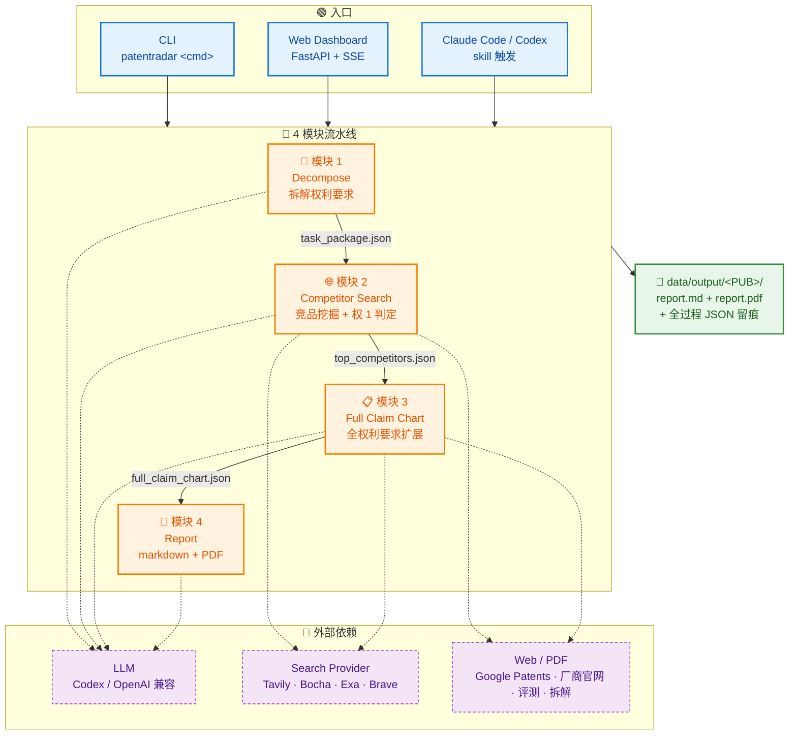

<div align="center">

# PatentRadar

**专利侵权竞品分析 · 全自动 · 可复核**

输入一个专利公开号，自动产出一份律师 / 工程师可直接复核的 claim chart 报告——含可点击的证据 URL、PDF 图像证据、逐特征推理链，以及"还缺什么 / 下一步去哪查"的可执行建议。

[](https://www.python.org/)
[](https://github.com/astral-sh/uv)
[](#-llm-后端)
[](#模式-2跨-agent-skill嵌入-claude-code--codex-cli)
[](#-license)

[快速开始](#-快速开始) · [架构](#%EF%B8%8F-架构) · [4 模块工作流](#-4-模块工作流) · [Skill 模式](#模式-2跨-agent-skill嵌入-claude-code--codex-cli)

</div>

---

## 为什么需要 PatentRadar

> 传统侵权排查靠人工：律师团队读专利权 → 拆特征 → 翻竞品手册 → 搜证据 → 写 claim chart，一份高质量报告动辄 2-5 天。

PatentRadar 把这条链路压到 **1 小时**：4 个模块串行流水线 + 多源搜索 + 多模态证据抓取 + 严苛评分规则，让 LLM 做"信息整理"和"逐特征对比"，把 **可追溯、可复核** 的 claim chart 报告直接交到律师手上。

### 设计原则

| 原则 | 体现 |
|---|---|
| **每条判定可追溯** | 「明确满足」必须有公开 URL 字面/数值证据（≥ 1 独立 host）；「可能满足」必须给 ①②③ 段 + (a)(b)(c)(d) 4 项对比的严谨推理链 |
| **证据缺口可执行** | 权 1 任何非"明确满足"特征都自动产出 `evidence_gap_brief`：「还缺 XXX / 下一步去 YYY 网站查 ZZZ 章节」 |
| **数学约束现场算** | 涉及 D/V、S/E、L/S 等比例约束的特征，必须从证据里抽数值现场代入公式算到具体结果，不许写"满足公式约束" |

---

## ✨ 功能亮点

- **🔍 4 模块流水线**　拆解权利要求 → 全网竞品搜索 → 全权扩展对比 → 生成可复核报告，每一步落盘 JSON 可单步重跑
- **🌐 多搜索源智能路由**　Tavily / Bocha / Exa / Brave 四套 search provider 按 query 类型自动选最优 2-3 个，支持 key 轮换 + 申请人自家域名过滤
- **🖼 多模态证据**　PDF 关键页 OCR + 产品页 / 拆解文章嵌图 / 电路图自动抓取，LLM 直接读图取尺寸/结构/连接关系
- **📊 实时 Dashboard**　FastAPI + SSE 后端 + 单页 Web UI，4 个模块进度可视化，每一次 LLM 调用 / 工具调用全程留痕，支持回放与离线 HTML 导出
- **🧠 双 LLM 后端**　ChatGPT OAuth（Codex Responses SSE，gpt-5.5 默认）或任意 OpenAI 兼容网关（aihubmix / DeepSeek / 自建）一键切换
- **📄 自动 PDF 渲染**　WeasyPrint + PingFang SC 中文字体 + 表格防溢出 CSS，markdown / PDF 双格式落盘
- **🤖 双模运行**　既能作为独立项目跑（CLI / Web），又能作为 Claude Code / Codex CLI 的 skill 被其他 agent 调用

---

## 🏗️ 架构



### 双模运行结构

```
PatentRadar/
├── src/patentradar/           ← 模式 1：独立项目（直接 uv run）
│   ├── cli.py                 ← typer CLI 入口
│   ├── server/                ← FastAPI Dashboard + SSE
│   ├── modules/               ← 4 模块各自的 pipeline.py
│   ├── llm/                   ← Codex / OpenAI 适配 + prompts/
│   ├── fetcher/               ← Google Patents / PDF / 通用 web fetcher
│   ├── search/                ← 4 个 search provider + 智能路由
│   └── schemas/               ← Pydantic 数据契约（贯穿 4 模块）
│
└── .claude/skills/patentradar/   ← 模式 2：作为 Claude Code skill 被其他 agent 调用
    ├── SKILL.md                  ← skill 入口（声明触发词 / 工作流）
    ├── agents/                   ← 4 个 subagent 的完整 prompt
    │   ├── decompose.md
    │   ├── competitor_search.md
    │   ├── full_claim_chart.md
    │   └── report.md
    ├── schemas/                  ← 与 src 完全一致的 JSON Schema 契约
    │   └── validate.py           ← 模块间自动 schema 校验
    ├── configs/                  ← 9 大技术领域 + 垂类网站清单
    │   └── technology_tags.toml
    └── scripts/render_pdf.py     ← 与 src 共用的 PDF 渲染脚本
```

> 两套模式**共享同一份数据契约**（Pydantic schema ↔ JSON Schema）和**同一套核心规则**（评分阈值 / SKU 锁定 / 证据缺口模板），保证报告产出一致。

---

## 🚀 快速开始

### 前置依赖

- Python ≥ 3.14
- [uv](https://github.com/astral-sh/uv)（推荐的 Python 包管理器）
- 至少一个搜索 API key（Tavily / Bocha / Exa / Brave 任一即可，越多越好）
- LLM 后端二选一：
  - **Codex**（推荐，免费 ChatGPT 订阅可用）：先跑 `codex login` 完成 OAuth
  - **OpenAI 兼容**：aihubmix / DeepSeek / 自建网关等

### 安装

```bash
git clone https://github.com/<your-org>/PatentRadar.git
cd PatentRadar
uv sync                          # 装全部依赖
cp .env.example .env             # 填入 API keys 和 backend 选择
```

### 模式 1：独立项目（CLI / Web）

#### 方式 A — 一行命令跑完整 pipeline

```bash
uv run python scripts/run_full_pipeline.py CN110293961B \
    --out-dir data/output/CN110293961B
```

跑完后产物在 `data/output/CN110293961B/`：

```
├── task_package.json                # 模块 1：权利要求拆解
├── step2_search_results.json        # 模块 2：搜索原始结果
├── step3_candidate_shortlist.json
├── step4_candidate_evidence.json
├── step5_top5_claim1_candidates.json
├── top5_full_claim_chart.json       # 模块 3：全 claim 对比
├── report.md                        # 模块 4：最终报告（markdown）
└── report.pdf                       #         最终报告（PDF）
```

#### 方式 B — 分步跑（调试 / 重跑某一步）

```bash
uv run patentradar decompose CN110293961B
uv run patentradar competitor-search data/output/CN110293961B/task_package.json
uv run patentradar full-claim-chart  data/output/CN110293961B/task_package.json \
                                     data/output/CN110293961B/step5_top5_claim1_candidates.json
uv run patentradar report            data/output/CN110293961B/task_package.json \
                                     data/output/CN110293961B/top5_full_claim_chart.json
```

#### 方式 C — 启动 Web Dashboard

```bash
uv run uvicorn patentradar.server.app:app --reload --port 8000
```

浏览器打开 `http://localhost:8000`：

- 输入专利公开号，点「开始分析」
- 4 个模块进度、每一次 LLM 调用 / 搜索调用 / 网页 fetch 实时显示
- 跑完后可回放（1x / 20x / 100x / 600x 倍速），支持导出离线 HTML 分享给同事

### 模式 2：跨 agent skill（嵌入 Claude Code / Codex CLI）

把 `.claude/skills/patentradar/` 目录放到你的 [Claude Code](https://docs.claude.com/claude-code) skill 路径下（或软链）。

在 Claude Code / Codex CLI 中：

```text
> 帮我跑下 CN114512759B 的侵权竞品分析
```

skill 会自动触发，按顺序 spawn 4 个独立 subagent，每个 subagent 跑完用 JSON Schema 自动校验产物（失败时把错误清单透传给该 subagent 让它修正后重交，最多重试 2 次），4 个模块全跑完后告诉你 `report.md` / `report.pdf` 落盘位置。

**与模式 1 的差异**：

| 维度 | 模式 1（src 直跑）| 模式 2（skill）|
|---|---|---|
| 调度 | Python pipeline.py 串联 | 主 agent spawn 4 个 subagent |
| LLM 调用 | 项目内的 `llm/provider.py` 统一发包 | 由宿主 agent（Claude Code / Codex）的对话能力直接调用 |
| 搜索 / 抓页 | 项目内的 `search/` + `fetcher/` 模块 | 由宿主 agent 的 WebSearch / WebFetch 工具直接调用 |
| 可观测 | Web Dashboard + 4 个 module log 文件 | 宿主 agent 的对话窗口 + 落盘 JSON |
| 适用场景 | 批量跑、CI/CD 集成、生产值守 | 单次 ad-hoc 分析、与其它 agent 协作、本地无 LLM key 但有 ChatGPT Plus |

---

## 🔄 4 模块工作流

### 📑 模块 1 · Decompose（拆解权利要求）

**做什么**：抓 Google Patents 公开文本 → LLM 把每条权利要求（独立 + 从属）拆成原子特征 → 主题前序作为首条 feature 保留 → HTML 有图 / 公式乱码时回退到 PDF Vision 还原。

**产物**：`task_package.json` —— 全部权利要求 + 拆解后的 `C{claim}-F{idx}` 原子特征 + 申请人识别信号 + 技术领域 tag（9 选一）。

### 🌐 模块 2 · Competitor Search（竞品挖掘 + 权 1 判定）

**做什么**：

1. **生成搜索 query**：基于权 1 关键词 + 技术 tag → 30-50 条中英双语 query，按意图（规格书 / 新闻 / 拆解 / 学术）路由到不同 search provider
2. **筛候选**：搜索结果交叉聚合 → LLM 抽出 8-12 个具体竞品（带 SKU 锁定标识）→ 排除申请人自家产品
3. **抓证据**：每个候选独立抓页面 + PDF + 图片 → LLM 多模态评估权 1 各特征 → 给出 `明确满足 / 可能满足 / 证据不足 / 明确不满足` 四档判定
4. **Gap 轮补搜**：对"证据不足 / 可能满足"特征 LLM 主动建议 follow-up query → 代码端跑补搜 → 再判一次
5. **TOP-N 排名**：按 total_score 排序，落 TOP 5 候选

**产物**：`step5_top5_claim1_candidates.json` —— TOP 候选 + 每个候选的权 1 逐特征对比 + 证据 URL / snippet / 图片 + 推理链。

### 📋 模块 3 · Full Claim Chart（全权利要求扩展）

**做什么**：复用模块 2 证据池 + 扩展到**全部从属权利要求** → 缺口特征主动补搜（query 必带 SKU 标识词，避免拉回其他 SKU 资料）→ Round 2 终判 → 对权 1 中所有"证据不足 / 可能满足"特征生成 `evidence_gap_brief`（"还缺什么 / 下一步去哪查"两行）。

**关键设计**：
- **`total_score` 只看权 1**（从属权满足度不进 ranking，避免权 1 已"明确满足"的候选因从属权证据稀疏被错误压低分）
- **失效只看权 1**（仅权 1 任一特征"明确不满足"或 launch_date 早于专利申请日才 disqualified）

**产物**：`top5_full_claim_chart.json`。

### 📝 模块 4 · Report（markdown + PDF 报告）

**做什么**：把模块 1 / 3 数据组装成 4 章节的 markdown 报告 → WeasyPrint 渲染 PDF（A4 + PingFang SC + 表格防溢出 CSS）。

**报告结构**：

1. **专利详细信息**　公开号 / 标题 / 申请人 / 发明人 / 申请日 / Google Patents 链接
2. **整体侵权风险评估**　最高分竞品介绍 + 权 1 满足情况速览 + TOP-N 一览表（rowspan 合并单元格的缺口 + 下一步建议汇总）
3. **TOP-N 竞品深度对比**　每个候选展示 SKU 锁定 / 上市日期 / 总分 / 全部权利要求的逐特征对比表（含证据 URL + 完整 reasoning）
4. **相似专利人工核查**（max_total_score ≥ 80 才出）　预生成 Google Patents 高级检索深链，让律师核查同族延续案 / 分案

---

## ⚙️ 配置

### LLM 后端

`.env` 中 `PATENTRADAR_LLM_BACKEND` 二选一：

```bash
# 选项 1：Codex（推荐，免费 ChatGPT Plus 订阅可用）
PATENTRADAR_LLM_BACKEND=codex
PATENTRADAR_MODEL=gpt-5.5
PATENTRADAR_CONTEXT_LENGTH=258000
PATENTRADAR_REASONING_EFFORT=high

# 选项 2：任意 OpenAI 兼容网关
PATENTRADAR_LLM_BACKEND=openai
PATENTRADAR_MODEL=deepseek-chat
PATENTRADAR_OPENAI_BASE_URL=https://api.deepseek.com/v1
PATENTRADAR_OPENAI_API_KEY=sk-xxxxxx
PATENTRADAR_CONTEXT_LENGTH=128000
PATENTRADAR_OPENAI_VISION=false       # 模型不支持图像时设 false
```

### 搜索 Provider

至少连接一个，连越多召回越广。**Tavily 支持多 key 轮换**（逗号分隔）：

```bash
TAVILY_API_KEY=key1,key2,key3
BOCHA_API_KEY=...                # 中文搜索强项
EXA_API_KEY=...                  # 英文 neural 搜索强项
BRAVE_API_KEY=...                # 英文新闻 / 评测强项
```

智能路由表（节选）：

| 意图 | 中文优先序 | 英文优先序 |
|---|---|---|
| 规格书 / datasheet | bocha → brave → tavily | exa → tavily → brave |
| 拆解 / teardown | brave → bocha → tavily | brave → tavily |
| 上市日期 / 发布新闻 | bocha → brave | brave → tavily |

### 技术领域 + 垂类网站清单

[`.claude/skills/patentradar/configs/technology_tags.toml`](.claude/skills/patentradar/configs/technology_tags.toml) 维护了 **9 大技术领域**（动力电池 / 电驱系统 / 智能驾驶 / 车身底盘 …）+ 每个领域的推荐垂类站点（如电池领域优先用 `batteryfinds.com`、车型维修手册优先用 `汽修巴巴`）。新增推荐网站只改这个 toml 即可。

---

## 📁 项目结构

```
PatentRadar/
├── src/patentradar/                  # 项目源码（独立运行模式）
│   ├── cli.py                        # typer CLI: decompose / competitor-search / ...
│   ├── modules/                      # 4 模块各自的 pipeline.py
│   │   ├── decompose/
│   │   ├── competitor_search/        # 5 步：query → search → filter → evidence → rank
│   │   ├── full_claim_chart/
│   │   └── report/
│   ├── llm/
│   │   ├── codex.py                  # Codex Responses SSE 适配
│   │   ├── openai_compat.py          # OpenAI 兼容 /chat/completions 适配
│   │   ├── provider.py               # 统一接口 + 流式 payload 压缩
│   │   └── prompts/                  # 所有 LLM prompt（与 skill agents/ 同步）
│   ├── fetcher/                      # Google Patents / PDF / 通用 web
│   ├── search/                       # Tavily / Bocha / Exa / Brave + router
│   ├── schemas/                      # Pydantic 数据契约
│   └── server/                       # FastAPI Dashboard + SSE
├── .claude/skills/patentradar/       # 跨 agent skill 模式
│   ├── SKILL.md
│   ├── agents/                       # 4 个 subagent 的完整 prompt
│   ├── schemas/                      # JSON Schema（与 src/schemas 同源）
│   ├── configs/technology_tags.toml  # 9 领域 + 垂类网站
│   └── scripts/render_pdf.py
├── web/                              # Dashboard 单页前端（HTML + CSS + JS）
├── scripts/
│   ├── run_full_pipeline.py          # 4 模块一键串行
│   └── smoke_aihubmix.py             # 跨 LLM backend 烟囱测试
├── configs/                          # 搜索过滤规则
├── tests/                            # 各模块 fixture + 历史产物
├── data/output/<PUB>/                # 报告落盘（gitignored）
└── logs/<PUB>/                       # 每模块原始 LLM payload 与响应（调试用）
```

---

## 🛣️ Roadmap

- [ ] **多 claim 失效短路**：模块 3 全权扩展过程中如果发现权 1 失效，立即停搜余下从属权
- [ ] **国际专利同族**：模块 4 自动检索同族 + 续案 + 分案的 claim chart 差异
- [ ] **跨数据库证据扩展**：接入 IEEE / arXiv / Espacenet / WIPO 学术专利数据
- [ ] **批量分析**：从 CSV 读多个公开号，并行跑流水线 + 汇总 dashboard

---

## 🧪 开发

```bash
uv sync --dev                                # 装测试依赖
uv run pytest tests/                         # 单元 + 集成测试
uv run python scripts/smoke_aihubmix.py      # 跨 LLM backend 烟囱测试
```

调试某次跑挂掉的模块：

```bash
# 所有 LLM 原始 payload 和响应都落盘在
logs/<PUB>/module_<N>/

# 单步重跑：直接复用上一步产物 JSON，命令见「方式 B 分步跑」
```

---

## 🤝 贡献

欢迎 issue / PR。改 prompt 时请同步修改两个位置：

- `src/patentradar/llm/prompts/*.md` （独立项目模式）
- `.claude/skills/patentradar/agents/*.md` （skill 模式）

两份 prompt 的核心规则（评分阈值 / SKU 锁定 / 证据缺口模板）必须保持一致——否则两种模式产出会出现"同一专利不同结论"。

---

## 📄 License

MIT
